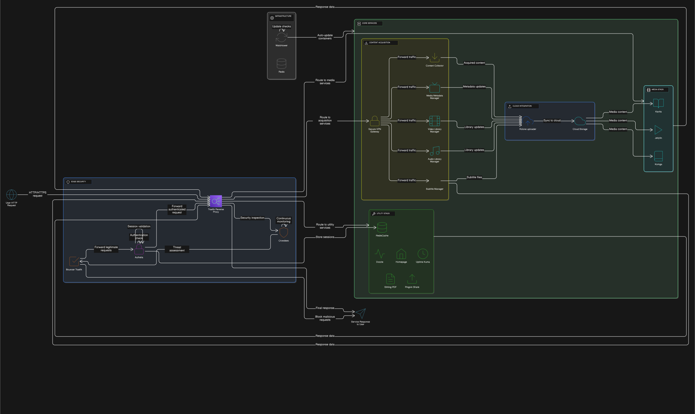

# Homelab

This is a self-hosted infrastructure built with Docker containers. Highlights: containerization, reverse proxy setup, security, and automated service management.

## Technical Overview

This homelab project includes:

- **Automatic SSL certificate management** using Let's Encrypt and Cloudflare
- **Multi-factor authentication** and security systems
- **Reverse proxy networking** with centralized management
- **Automatic container updates**
- **Complete monitoring and logging** setup

## Open Source Contributions

**Stirling-PDF: Feature Development**

Contributed features to Stirling PDF, a popular open-source document processing application used by many people worldwide. 

**1. EML to PDF Conversion Feature**
*GitHub Commit (initial PR): [#3650]([https://github.com/Stirling-Tools/Stirling-PDF/commit/9fbb0325b52bd27f01c62eeca3bd937200619c9c](https://github.com/Stirling-Tools/Stirling-PDF/pull/3650))*

Developed complete email-to-PDF conversion functionality with advanced features:

**Backend Implementation:**
- Built REST API endpoint `/api/v1/convert/eml/pdf` with Spring Boot
- Created `EmlToPdfRequest` model with validation and parameter handling
- Implemented email parsing with Jakarta Mail API integration

**Features/Highlights:**
- Attachment support with PDF annotations and click-to-open functionality
- Automatic attachment catalog generation with paperclip navigation
- Character encoding support for international characters (ö, ő, ü, etc.)
- Optional HTML download alongside PDF conversion
- Link and formatting preservation

Demo available at: https://stirling.szucsb.eu/eml-to-pdf (*Please note: This demo runs on an alpha version of Stirling-PDF. As a pre-release, you may encounter some bugs or unexpected behavior.*)

*Note: Some of the attachment handling code was later reused to help implement the [add-attachments feature](https://stirling.szucsb.eu/add-attachments), assisted the maintainer with this additional functionality.*

**2. "Fake Scan" Feature Development**
*GitHub Commit: [#3650]([https://github.com/Stirling-Tools/Stirling-PDF/commit/631c4fef0baefa30f03cf8170aa47a9ef305013a](https://github.com/Stirling-Tools/Stirling-PDF/pull/3530))*

Built realistic document scanning simulation with a lot of customization options:

**Backend Development:**
- Built complete REST API endpoint with Spring Boot
- Implemented PDF processing with customizable parameters
- Cleaned up legacy/WIP code

**Features/Highlights:**
- Scan quality adjustment and rotation control
- Advanced settings including colorspace, border, rotation angle, and brightness
- Realistic aging effects with yellowish tint simulation
- Custom resolution (DPI) and rotation variance settings

*Demo available at: https://stirling.szucsb.eu/fake-scan*
(*Please note: This demo runs on an alpha version of Stirling-PDF. As a pre-release, you may encounter some bugs or unexpected behavior.*)

**Ongoing Contributions & Maintenance**

Beyond the features, I continue to contribute with smaller improvements and maintenance focusing on more on maintenance/localization

**Testing & Quality Assurance:**
- Added JUnit tests for EML-to-PDF conversion ([#3806](https://github.com/Stirling-Tools/Stirling-PDF/commit/6461b931317b83e2a5be9670d2af4b41f4bba27a))
- Fixed mockTempFileManager in EML-to-PDF tests (#3826)
- Bug fixes for EML-to-PDF: font compatibility and dependency improvements (#3770)

**Localization & Internationalization:**
- Hungarian translations for multiple features: audit dashboard (#3765), teams feature (#3710, #3701, #3662), fake-scan and EML-to-PDF (#3646, #3451)
- Thai language support for watermarking and stamp features (#3819, #3825)
- Updated language list to use native names (#3464)

**UI/UX Improvements:**
- Fixed convert button visuals and code consistency for EML-to-PDF (#3707)
- Default encryption settings optimization (#3693)
- Permission variable refactoring (#3457)

**My OSS developement "journey", or what I learnt along the way:**
- **Git Workflow:** Branch management, cleaning up commit history (WIP), merge conflict resolution
- **Pull Request Process:** Code review cycles, addressing maintainer feedback
- **Collaboration:** Working with project maintainers and inside community guidelines
- **Code Quality:** Following coding standards,  as well as PR/Commit standards

## Homelab architecture Components

The infrastructure uses modular design with separate service groups:

### Security & Network Layer (`edge.yml`)
- **Traefik** - Reverse proxy with automatic service discovery
- **Authelia** - Authentication service with two-factor support
- **CrowdSec** - Security system that analyzes behavior

### Application Layer (`media.yml`)
- **Jellyfin** - Media server with video transcoding
- **Kavita** - Digital library management system
- **Komga** - Content platform with REST API

### Operations & Monitoring (`utils.yml`)
- **Dozzle** - Real-time log viewing and analysis
- **Uptime Kuma** - Service monitoring with alerts
- **Stirling PDF** - Document processing service
- **Pingvin Share** - Secure file sharing

### Infrastructure Layer (`infra.yml`)
- **Watchtower** - Automatic container updates
- **Redis** - Fast in-memory data storage

### Data Management Layer (`downloads.yml`)
- **Network Gateway** - Network isolation and VPN routing
- **Transfer Client** - P2P client with web interface
- **Content Organizers** - Automatic content management
- **Metadata Service** - Subtitle download and sync service

## Technical Skills Demonstrated

- **Containerization:** Docker, Docker Compose, container builds
- **Networking:** Reverse proxy setup, VPN routing, service connections
- **Security:** SSL automation with Traefik, authentication systems with Authelia, threat detection with Crowdsec
- **DevOps:** Infrastructure as Code, automatic deployments, container management
- **Monitoring:** Log collection, health checks

## Implementation Highlights

**Infrastructure as Code**
- Modular Docker Compose setup with environment-based deployment
- Automatic SSL certificate setup using ACME protocol
- Service configuration with dependency management

**Security Architecture**
- Network model with required authentication
- Encrypted traffic routing through VPN tunnels (where it's needed)
- Threat detection with automatic response

**High Availability Design**
- Health checks for all services
- Automatic restart and recovery systems
- Central logging and monitoring with alerts

## Technologies Used

- **Containers:** Docker, Docker Compose
- **Reverse Proxy:** Traefik with Let's Encrypt, Traefik plugins like Geoblock, cache, Cloudflare real IP tracker
- **Authentication:** Authelia with one-factor authentication for simplicity, can be configured for more
- **Security:** CrowdSec, VPN routing with WireGuard
- **Networking:** Docker networks, service discovery, SSL management
